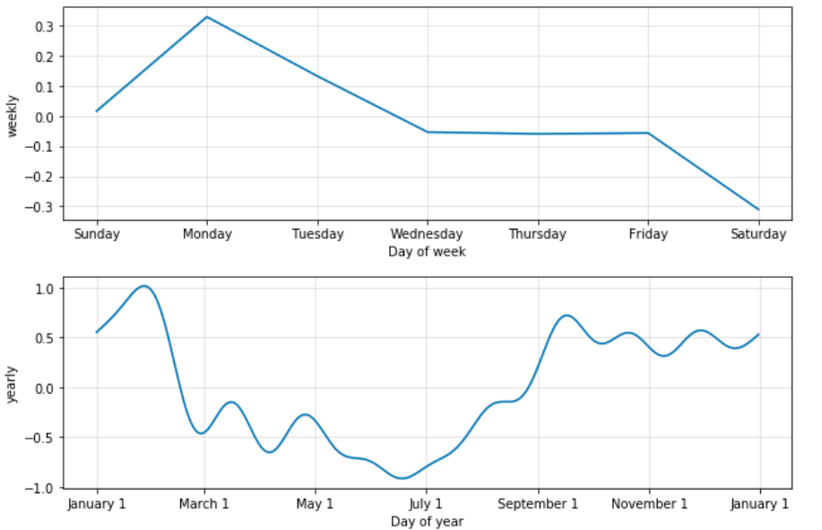
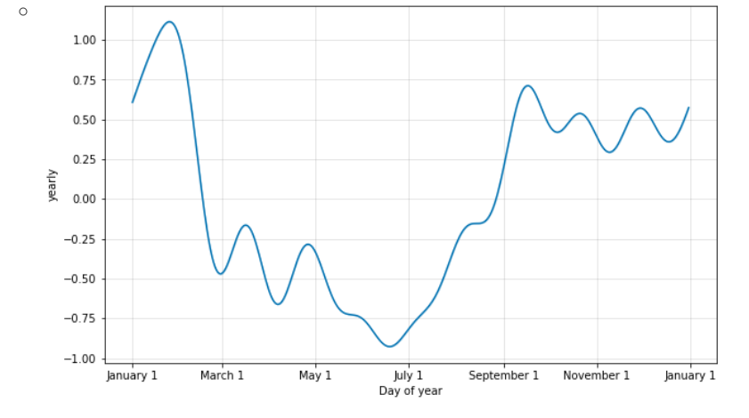
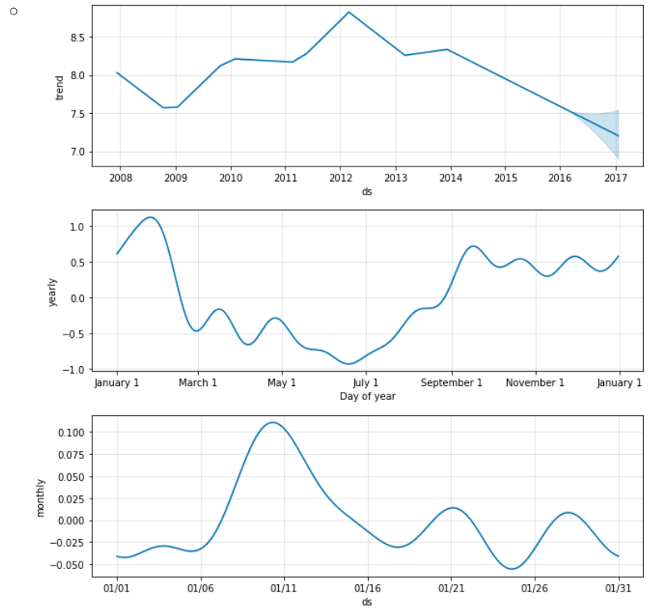

# prophet


prophet 은 페이스북에서 개발한 시계열 예측 패키지이다.

ARIMA와 같은 확률론적이고 이론적인 모형이 아니라 몇가치 경험적 규칙을 사용하는 단순 회귀모형이지만 단기적 예측에서는 큰 문제 없이 사용할 수 있다.


## 설치

```python
conda install pystan
conda install -c conda-forge fbprophet
```


## 사용법

```python
import pandas as pd

url = "https://raw.githubusercontent.com/facebook/prophet/master/examples/example_wp_log_peyton_manning.csv"
df = pd.read_csv(url)
df.tail()
```

|      |         ds |         y |
| :--- | ---------: | --------: |
| 2900 | 2016-01-16 |  7.817223 |
| 2901 | 2016-01-17 |  9.273878 |
| 2902 | 2016-01-18 | 10.333775 |
| 2903 | 2016-01-19 |  9.125871 |
| 2904 | 2016-01-20 |  8.891374 |


```python
# prophet의 로그 기능 끄기
import logging
logging.getLogger('fbprophet').setLevel(logging.WARNING)
```

사용법은 간단하다. Prophet 클래스 객체를 만들고 시계열 데이터를 입력으로 fit 메서드를 호출한다.


```python
from fbprophet import Prophet

m = Prophet()
m.fit(df)
```

```
ERROR:fbprophet:Importing plotly failed. Interactive plots will not work.
<fbprophet.forecaster.prophet at 0x7f3b30092f28>
```


예측을 하려면 다음 메서드를 사용한다.

- `make_future_dataframe`: 예측 날짜 구간 생성
- `predict`: 신뢰 구간을 포함한 예측 실행

```python
future = m.make_future_dataframe(periods=365) #예측하고자 하는 날수
future.tail()
```

| ds   |            |
| :--- | ---------- |
| 3265 | 2017-01-15 |
| 3266 | 2017-01-16 |
| 3267 | 2017-01-17 |
| 3268 | 2017-01-18 |
| 3269 | 2017-01-19 |

```python
forecast = m.predict(future)
forecast.tail()
```

| ds   |      trend | yhat_lower | yhat_upper | trend_lower | trend_upper | additive_terms | additive_terms_lower | additive_terms_upper |   weekly | weekly_lower | weekly_upper |    yearly | yearly_lower | yearly_upper | multiplicative_terms | multiplicative_terms_lower | multiplicative_terms_upper | yhat |          |
| :--- | ---------: | ---------: | ---------: | ----------: | ----------: | -------------: | -------------------: | -------------------: | -------: | -----------: | -----------: | --------: | -----------: | -----------: | -------------------: | -------------------------: | -------------------------: | ---: | -------- |
| 3265 | 2017-01-15 |   7.180847 |   7.435809 |    8.948534 |    6.827810 |       7.552677 |             1.018428 |             1.018428 | 1.018428 |     0.048295 |     0.048295 |  0.048295 |     0.970133 |     0.970133 |             0.970133 |                        0.0 |                        0.0 |  0.0 | 8.199274 |
| 3266 | 2017-01-16 |   7.179809 |   7.755114 |    9.291769 |    6.825133 |       7.552981 |             1.344435 |             1.344435 | 1.344435 |     0.352287 |     0.352287 |  0.352287 |     0.992148 |     0.992148 |             0.992148 |                        0.0 |                        0.0 |  0.0 | 8.524244 |
| 3267 | 2017-01-17 |   7.178771 |   7.530683 |    9.036235 |    6.822456 |       7.553219 |             1.132844 |             1.132844 | 1.132844 |     0.119624 |     0.119624 |  0.119624 |     1.013220 |     1.013220 |             1.013220 |                        0.0 |                        0.0 |  0.0 | 8.311615 |
| 3268 | 2017-01-18 |   7.177733 |   7.413488 |    8.845561 |    6.820041 |       7.553632 |             0.966499 |             0.966499 | 0.966499 |    -0.066647 |    -0.066647 | -0.066647 |     1.033146 |     1.033146 |             1.033146 |                        0.0 |                        0.0 |  0.0 | 8.144232 |
| 3269 | 2017-01-19 |   7.176695 |   7.425690 |    8.894338 |    6.818071 |       7.553324 |             0.979396 |             0.979396 | 0.979396 |    -0.072284 |    -0.072284 | -0.072284 |     1.051680 |     1.051680 |             1.051680 |                        0.0 |                        0.0 |  0.0 | 8.156091 |

```python
forecast.iloc[-365:, :].yhat.plot()
```


다음 메서드를 사용하면 시계열을 시각화할 수 있다.

- `plot`: 원래의 시계열 데이터와 예측 데이터
- `plot_components`: 선형회귀 및 계절성 성분별로 분리


```python
fig1 = m.plot(forecast, uncertainty=False)
plt.show()
fig2 = m.plot_components(forecast)
plt.show()
```


### 기본 원리[¶](https://datascienceschool.net/view-notebook/8903aa20770746e78fb5b1834ab5334b/#기본-원리)

Prophet은 다음 순서로 시계열에 대한 회귀분석 모형을 만든다.

- 시간 데이터의 각종 특징을 임베딩해서 계절성 추정을 한다.
- 나머지 데이터는 구간별 선형회귀(piecewise linear regression) 분석을 한다.

선형 회귀분석은 전체 시계열의 앞 80%부분을 25개의 구간으로 나누어 실시한다. 구간 구분점(change point)는 `changepoints` 속성에 있다.

[페이스북github](https://facebook.github.io/prophet/docs/trend_changepoints.html)


### Trend change points

* Prophet 에선 기본적으로 트렌드가 변경되는 지점을 자동으로 감지해 트렌드를 예측함

  * 감지하는 것을 사용자가 조절할수 있다.

* Prophet 객체를 생성할 때 `changepoint_range`, `changepoint_prior_scale`, `changepoints`을 조절

  * 1) changepoint_range
    * 기본적으로 Prophet은 시계열 데이터의 80% 크기에서 잠재적으로 ChangePoint를 지정
    * 90%만큼 ChangePoint로 지정하고 싶다면 아래와 같이 설정

  ```python
  m = Prophet(changepoint_range=0.9)
  ```

  * 2) changepoint_prior_scale
    * Change Point의 유연성을 조정하는 방법
    * 오버피팅이 심하면 너무 유연한 그래프가 나와서 모든 값에 근접하고, 언더피팅일 경우 유연성이 부족
    * 기본 값은 0.05
    * 이 갑을 늘리면 그래프가 유연해지고(=언더피팅해결), 이값을 줄이면 유연성이 감소(=오버피팅 해결)

  ```python
  m=Prophet(changepoint_prior_scale=0.05)
  ```

  * 3) changepoints(list)
    * 잠재적으로 change point일 수 있는 날짜들
    * 명시하지 않으면 잠재적인 changepoint가 자동으로 설정됨

  ```python
  m=Prophet(changepoints=['2019-02-04', '2019-02-05'])
  ```

  

### Seasonality, Holiday Effects, And Regressors

* Modeling Holidays and Special Events

  * 휴일이나 모델에 반영하고 싶은 이벤트가 있으면 Dataframe을 생성해 반영할수 있다.
  * 이벤트는 과거 데이터와 미래 데이터가 모두 포함되어 있어야한다.
  * 주변 날짜를 포함시키기 위해 lower_window, upper_window를 사용해 업데이트의 영향을 조절가능
  * 예제는 Play Off 경기일과 superbowl 경기날을 Holiday로 설정

  ```python
    playoffs = pd.DataFrame({
  'holiday': 'playoff',
  'ds': pd.to_datetime(['2008-01-13', '2009-01-03', '2010-01-16',
                        '2010-01-24', '2010-02-07', '2011-01-08',
                        '2013-01-12', '2014-01-12', '2014-01-19',
                        '2014-02-02', '2015-01-11', '2016-01-17',
                        '2016-01-24', '2016-02-07']),
  'lower_window': 0,
  'upper_window': 1,
  })
    superbowls = pd.DataFrame({
      'holiday': 'superbowl',
      'ds': pd.to_datetime(['2010-02-07', '2014-02-02', '2016-02-07']),
      'lower_window': 0,
      'upper_window': 1,
    })
    holidays = pd.concat((playoffs, superbowls))
  ```

  * 사용하는 방법은 간단, Prophet 객체를 생성할때 holidays 인자로 넘기면된다.

  ```python
  m=Prophet(holidays=holidays)
  forecast = m.fit(df).predict(future)
  ```

  * holiday effect를 아래 코드로 확인할수 있다.

  ```python
  forecast[(forecast['playoff'] +forecast['superbowl']).abs() > 0][['ds', 'playoff', 'superbowl']][-10:]
  ```

  * plot_component로 시각화 할경우 holidays의 영향도 볼수 있다.

  
  * 만약 holidays에 오버피팅된것 같으면 holidays_prior_scale을 조정해 유연하게 변경 가능(기본값 10)

  ```python
    m = Prophet(holidays=holidays, holidays_prior_scale=0.05).fit(df)
    forecast = m.predict(future)
    forecast[(forecast['playoff'] + forecast['superbowl']).abs() > 0][
        ['ds', 'playoff', 'superbowl']][-10:]
  ```

* Built-in Country Holidays

  * Prophet 객체를 생성한 후, m.add_country_holidays(country_name='US') 이렇게 작성하면 국가의 휴일을 사용할수 있다.
  * 한국은 없다.

* Fourier Order for Seasonalities

  * Seasonalities를 부분 푸리에의 합을 사용해 추정
  * 푸리에 급수는 주기함수를 삼각함수의 급수로 나타낸것
  * yearly_seasonality 파라미터의 default는 10

  ```python
   from fbprophet.plot import plot_yearly
    m = Prophet(yearly_seasonality=10).fit(df)
    a = plot_yearly(m)
  ```

  

* Specifying Custom Seasonalities
  * 커스텀 시즈널리티를 생성할수 있다.
  * 기본적으로 weekly, yearly 특성제공
  * m.add_seasonality로 추가하면 인자는 name, period, fourier_order가 있다.
  * prior_scale을 조정해 강도 조절할수 있다.

```python
m = Prophet(weekly_seasonality=False)
  m.add_seasonality(name='monthly', period=30.5, fourier_order=5)
  forecast = m.fit(df).predict(future)
  fig = m.plot_components(forecast)
```



* Additional regressors
  * add_regressor 메소드를 사용해 모델의 linear 부분에 추가할수 있다.
  * 예제에선 NFL 시즌의 일요일에 추가 효과를 더함

```python
  def nfl_sunday(ds):
      date = pd.to_datetime(ds)
      if date.weekday() == 6 and (date.month > 8 or date.month < 2):
          return 1
      else:
          return 0
			    
  df['nfl_sunday'] = df['ds'].apply(nfl_sunday)
		
  m = Prophet()
  m.add_regressor('nfl_sunday')
  m.fit(df)
		
  future['nfl_sunday'] = future['ds'].apply(nfl_sunday)
		
  forecast = m.predict(future)
  fig = m.plot_components(forecast)
```


* Multiplicative Seasonality
  * 단순한 seasonality가 아닌 점점 증가하는 seasonlity를 다룰때 사용하면 좋은 기능
  * 데이터가 엄청 많을 경우 유용하다
  * 사용하는 방법은 단순함

```python
m=Prophet(seasonality_mode = 'multiplicative')
```


* Uncertainty Intervals
  * 불확실성의 범위가 나타나는 원인
    * 1) Trend의 불확실성
    * 2) Seasonality 추정의 불확실설
    * 3) 추가 관찰되는 잡음
  * Uncertainty in the trend
    * 예측을 하면 yhat_lower, yhat_upper 가 나타나는데 이 범위도 사용자가 조절할수 있다.
    * interval_width 의 기본 값은 80%
    * Changepoint_prior_scale을 조절하면 예측 불확실성이 증가함

```python
forecast = Prophet(interval_width=0.95).fit(df).predict(future)
```

- Uncertainty in seasonality

  - 시즈널리티의 불확실성을 알기 위해 베이지안 샘플링을 사용해야 함
  - mcmc.samples 파라미터를 사용. 이 값을 사용하면 최초 n일에 대해 적용한다는 뜻

  ```
    m = Prophet(mcmc_samples=300)
    forecast = m.fit(df).predict(future)
    fig = m.plot_components(forecast)
  ```

  - 
  - 이제 불확실성의 범위가 보임


------

### Outliers

- 

- 위와 같은 예측 그래프를 보면, 2016년부터 Uncertainty Intervals이 너무 큼

- 너무 튀는 값이 존재해서 예측할 때 영향이 미침

  - 이런 값들은 제외하고 예측해야 함
    - NA, None로 설정
  - 또는 상한선, 하한선 설정

  ```
    df.loc[(df['ds'] > '2010-01-01') & (df['ds'] < '2011-01-01'), 'y'] = None
    model = Prophet().fit(df)
    fig = model.plot(model.predict(future))
  ```


------

### Sub-daily Data

- 여태까지 사례는 모두 Daily 데이터였는데, 더 짧은 단위도 예측할 수 있음
  - Timestamp로 YYYY-MM-DD HH:MM:SS 형태로 저장
  - 사실 데이터 형태만 다른거고 여태와 동일함
- Data with regular gaps
  - 정기적인 gap이 있는 데이터도 예측할 수 있음
  - 매달 1일의 데이터만 있어도 월별로 예측 가능(부정확성이 더 늘겠지만!)